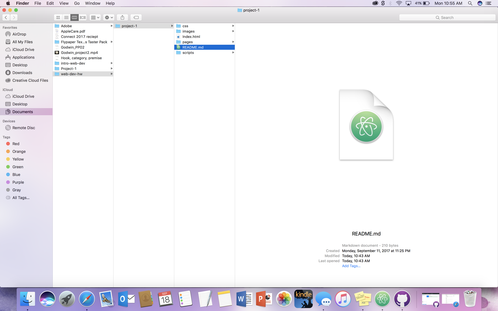

# My First README.md
<h1>Lauren Godwin</h1>
__Still super confused__ :sweat:
<h2>This is the most confusing class I've ever had to take.</h2>

 `<This is a inline code>` 

  

Here is my outside website link. This was the last website I was on because I just got my ticket for this saturday's game.[GrizTix](http://www.umt.edu/griztix/)

There are two types of lists.

 1. Ordered Lists 

 2. Unordered Lists 

 * Unordered lists are like bullet points 

 * Ordered lists are lists in sequence. 

