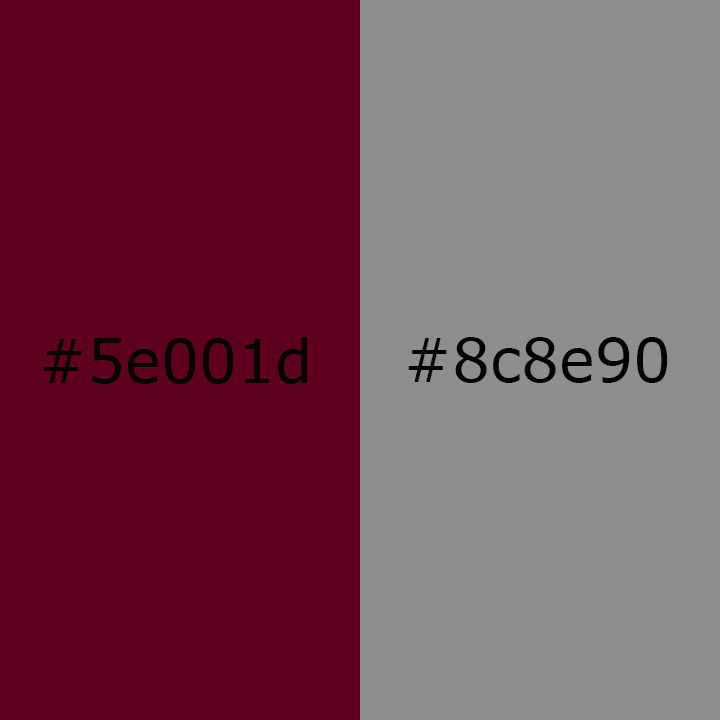

<h1>Project 3 Readme</h1>

I am going to do an article on my sister Elsa Godwin who recently committed to the Griz for volleyball. Since Elsa is committed to the Griz some of my palette colors will be maroon and grey. I might use purple and yellow too but those don't really go with maroon and grey.

I got the article from the Missoulian. <a href="http://missoulian.com/sports/high-school/volleyball/sentinel-s-elsa-godwin-commits-to-griz-volleyball-team/article_1e3835db-1218-559a-a3d7-1c890f9ad9f9.html"><cite>Sentinel's Elsa Godwin</cite></a> by Kyle Houghtaling, April 4, 2017

Kyle Houghtaling is a well known author for Sentinel's volleyball team. He has interviewed my sister many times. Everytime he does an article on Sentinel it is packed full of stats.

Some possible photos that I will use (Elsa is number 1):

I had a lot of fun with this assignment once I figured out the fonts.css page. I really struggled with that and making 2 fonts work at once. But I figured it out and I am really proud of how my cite turned out.

